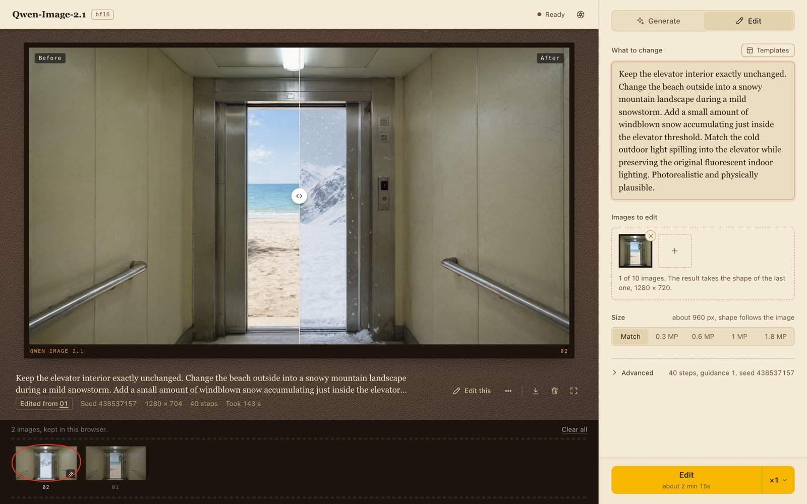
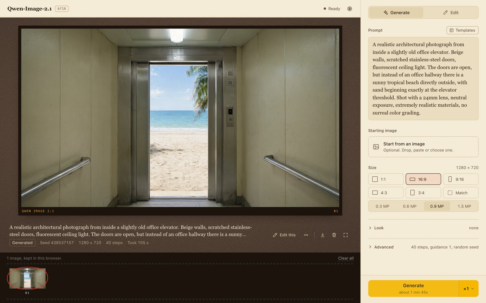
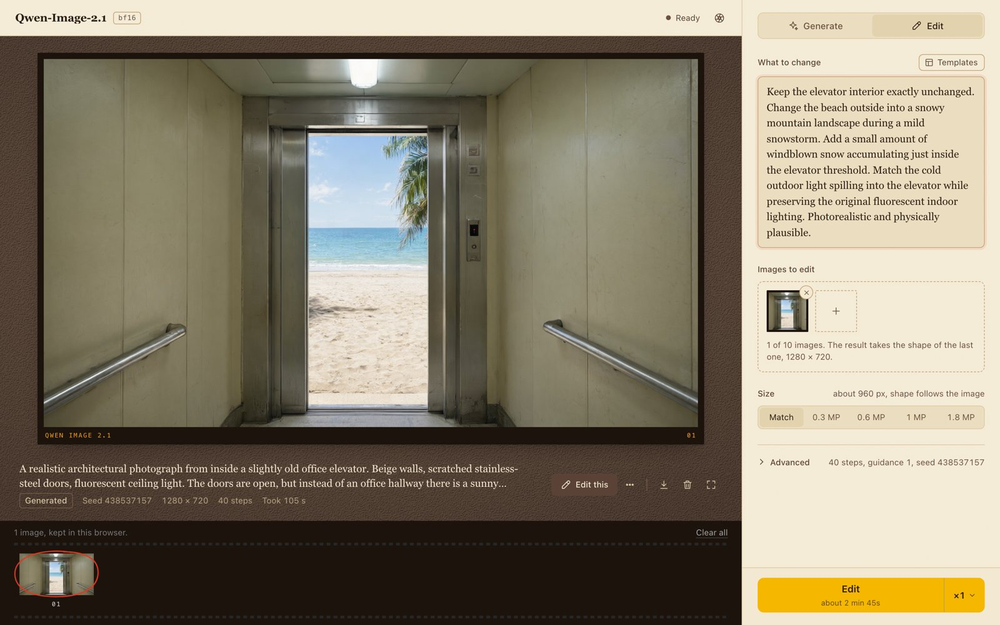
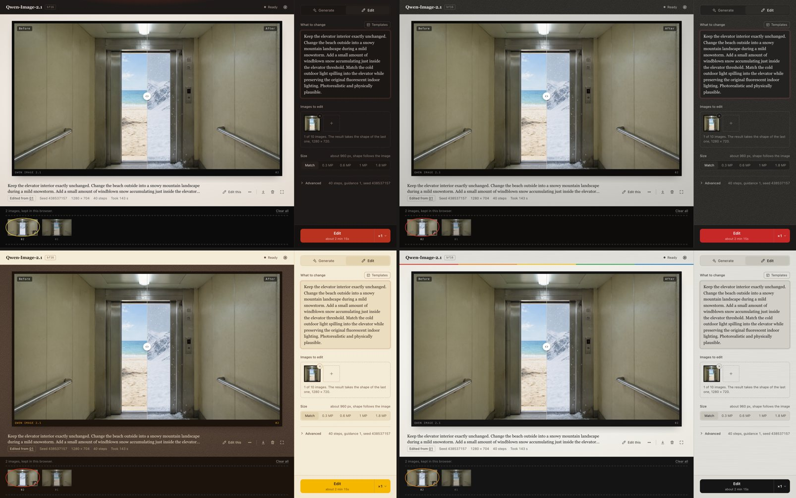

<h1 align="center"> image-gen</h1>

A local image generation page for Apple Silicon. Write a prompt, get an image, then say what to change. One page, one adapter per model. The server saves no image or prompt. Your browser keeps the images, with their prompts, until you clear them.

## Get started

This walk-through makes the image above: first a beach outside an elevator, then the same elevator in a snowstorm. It needs a Mac with Apple Silicon and [uv](https://docs.astral.sh/uv/). It was built on a machine with 64 GB of memory.

1. Clone the repo and start the page.

       git clone git@github.com:CJHwong/image-gen.git
       cd image-gen
       uv run studio

   The first start downloads the Qwen-Image-2.1 weights, about 33 GB. When the terminal says "Ready", open http://127.0.0.1:8765.

2. Paste this prompt into **Prompt**, pick **16:9** under **Size**, and press **Generate**.

       A realistic architectural photograph from inside a slightly old office elevator. Beige walls, scratched stainless-steel doors, fluorescent ceiling light. The doors are open, but instead of an office hallway there is a sunny tropical beach directly outside, with sand beginning exactly at the elevator threshold. Shot with a 24mm lens, neutral exposure, extremely realistic materials, no surreal color grading.

   The top bar counts the steps and the time left. The image took 105 s on the test machine.

   

3. Press **Edit this** under the image. The page switches to **Edit** and takes the image as the one to change. Paste this into **What to change**, then press **Edit**.

       Keep the elevator interior exactly unchanged. Change the beach outside into a snowy mountain landscape during a mild snowstorm. Add a small amount of windblown snow accumulating just inside the elevator threshold. Match the cold outdoor light spilling into the elevator while preserving the original fluorescent indoor lighting. Photorealistic and physically plausible.

   

4. The edit took 143 s. Drag the line across the result to compare before and after. The badge under the print reads "Edited from 01": click 01 to go back to the beach. Click the caption to read the whole prompt.

Both images stay in the strip at the bottom, also after a reload.

## How to

- **Use another port:** `uv run studio --port 9000`.
- **Save memory on qwen21:** `uv run studio -q 8` loads the weights as int8.
- **Use FLUX.2:** set up its weights (see [Models](#models)), then `uv run studio --backend flux2`. The title of the page becomes a menu that switches between the models. To offer both every time, add `"flux2"` to `visible_backends` in [studio.toml](studio.toml).
- **Write a prompt the model follows:** start from the **Templates** menu, and add a style from the **Look** section. Each model offers only the Look options that passed a test on it. [PROMPTS.md](studio/l3_interface_adapters/gateways/PROMPTS.md) has the tests.
- **Reuse a seed or a prompt:** open the **⋯** menu under the image. It also offers the image as a reference for the next run.
- **Keep an image outside the browser:** use the download button under the image.
- **Work in private:** open the theme menu (the aperture button, top right) and turn off **Keep in this browser**. The kept images leave the browser, and new ones stay in the tab until a reload.
- **Change the theme:** pick one in the theme menu. The page remembers it.

  

- **Work on the page without a model:** `uv run studio --stub`. Each model keeps its form, but a run shows fake steps and returns a placeholder image. It uses no GPU.

## Reference

### Command line

| Flag | Default | What it does |
|---|---|---|
| `--port` | `8765` | The port of the page. |
| `--host` | `127.0.0.1` | The address the server binds. |
| `--backend` | `default_backend` | Open on this model, and add it to the models the page offers. |
| `-q`, `--quantize` | the `studio.toml` value | Quantize the weights of the opening model: 3, 4, 5, 6 or 8 bits. |
| `--config` | `studio.toml` | The settings file. |
| `--stub` | off | Fake every engine: timed steps and placeholder images, no weights. |

### Settings in studio.toml

| Key | What it sets |
|---|---|
| `default_backend` | The model the page opens with. |
| `visible_backends` | The models the page offers. With more than one, the title becomes a menu. |
| `[qwen21] quantize` | 0 for bf16, or the bits for quantized weights. |
| `[qwen21] edit_script` | The diffusers script that runs edits in a child process. |
| `[flux2] quantize` | The bits for the FLUX.2 weights. |
| `[flux2] model_dir` | The folder of the FLUX.2 weights. |

### Keys

| Key | What it does |
|---|---|
| Cmd+Enter | Run, from anywhere on the page. |
| Left and Right arrows | Show the previous or next image in the strip. |
| F | Full screen. |
| Escape | Close a menu, or the whole prompt over the print. |

### Models

| Model | Adapter | Modes | Weights |
|---|---|---|---|
| Qwen-Image-2.1 (default) | `gateways/qwen21` | generate and img2img through mflux (MLX); instruction edit with up to 10 images through diffusers (MPS) | downloads itself |
| FLUX.2 klein-base-9B, uncensored | `gateways/flux2` | generate and img2img, edit with up to 4 images, all through mflux (MLX) | manual setup below |

Both adapters generate through MLX, so this server runs on Apple Silicon. It refuses to start a real studio where MLX is missing; `--stub` still works there, because it fakes the engines. Porting generation to another vendor is not built. The decisions it needs are in [PORTABILITY.md](studio/l3_interface_adapters/gateways/qwen21/PORTABILITY.md).

**Qwen-Image-2.1.** The weights are `Qwen/Qwen-Image-2.1` on HuggingFace. They are not gated, about 33 GB in bf16. They download into `~/.cache/huggingface` on the first run (`HF_HOME` moves the cache).

**FLUX.2 klein-base-9B.** mflux reads one diffusers-layout folder, and its name must contain `klein-base-9b`. The default is `~/Library/Caches/models/mflux-klein-base-9b-uncensored`; `model_dir` in `studio.toml` moves it. It takes about 33 GB.

1. Everything except the encoder weights comes from the uncensored transformer repo. It is not gated.

       M=~/Library/Caches/models/mflux-klein-base-9b-uncensored
       SRC=https://huggingface.co/darknight9121/FLUX.2-klein-base-9B-bucket-uncensored/resolve/main
       for f in model_index.json scheduler/scheduler_config.json \
                text_encoder/config.json text_encoder/generation_config.json \
                tokenizer/{added_tokens.json,chat_template.jinja,merges.txt} \
                tokenizer/{special_tokens_map.json,tokenizer.json,tokenizer_config.json,vocab.json} \
                transformer/config.json transformer/diffusion_pytorch_model.safetensors.index.json \
                transformer/diffusion_pytorch_model-0000{1,2}-of-00002.safetensors \
                vae/config.json vae/diffusion_pytorch_model.safetensors; do
         curl -L -C - --create-dirs "$SRC/$f" -o "$M/$f"
       done

2. The encoder weights come from the uncensored encoder repo. It is gated: accept its conditions on the HuggingFace page, then pass your token.

       E=~/Library/Caches/models/ponpoke-uncensored-qwen3-8b
       curl -L -C - --create-dirs -H "Authorization: Bearer $HF_TOKEN" \
         https://huggingface.co/ponpoke/flux2-klein-9b-uncensored-text-encoder/resolve/main/model.safetensors \
         -o "$E/model.safetensors"
       ln -s "$E/model.safetensors" "$M/text_encoder/model.safetensors"

   Fetch only `model.safetensors`. The `.gguf` files there are for llama.cpp.

## Why it looks like this

- **One page, one adapter per model.** The page asks the model what it supports and hides the rest. A new model is one adapter in `studio/`, and the page does not change. [studio/ARCHITECTURE.md](studio/ARCHITECTURE.md) has the layers and how to add a model.
- **Two engines for qwen21.** mflux is faster and quantizes, but it has no port of the Qwen3-VL vision tower that instruction editing needs. So editing runs on diffusers, in a child process.
- **The edit VAE encoder runs on the CPU.** MPS computes it wrong, and every reference image comes out washed out. [MPS-VAE-ENCODE.md](studio/l3_interface_adapters/gateways/qwen21/MPS-VAE-ENCODE.md) holds the measurements.
- **A batch is images in a row, not a real batch.** On this machine a batched flux2 run was 2 to 8% slower per image than one at a time, and it used more memory. One at a time also shows each image as soon as it is done.
- **One run at a time.** The GPU is full with one run, and two only slow each other. A run from a second tab gets a message to wait, not a place in a queue.
- **The server writes nothing to disk.** It keeps neither the prompt nor the image, and it binds 127.0.0.1. The browser keeps the images in its own storage, which belongs to the address and port. So a server on another port shows an empty strip.

## Licenses

The weights keep their own licenses. Qwen-Image-2.1 is under the Qwen Research License, which allows research use only. FLUX.2 klein-base-9B is under the FLUX Non-Commercial License. Check them before you use any output commercially.
